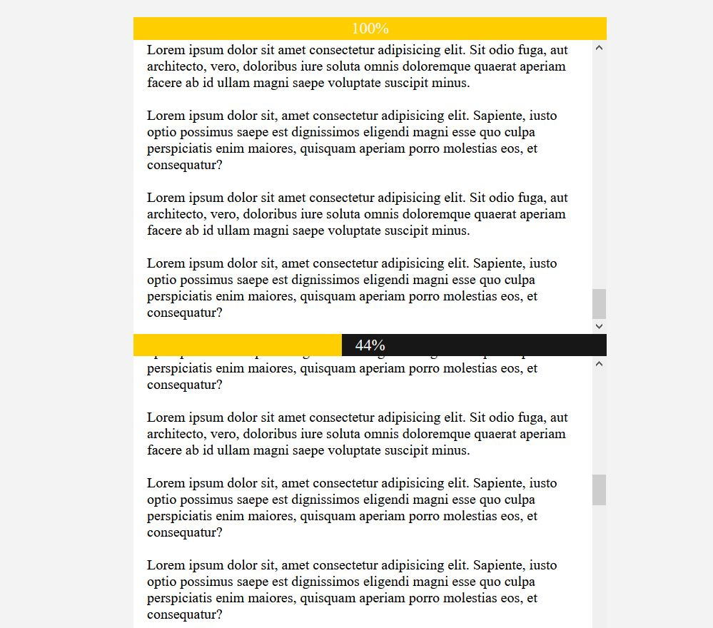

# percentage-scroll



## Project setup
```
npm install
```

### Compiles and hot-reloads for development
```
npm run serve
```

### Compiles and minifies for production
```
npm run build
```

### Run your tests
```
npm run test
```

### Lints and fixes files
```
npm run lint
```
#credits
https://www.youtube.com/watch?v=BoU-1Vz3Bi4&t=681s
